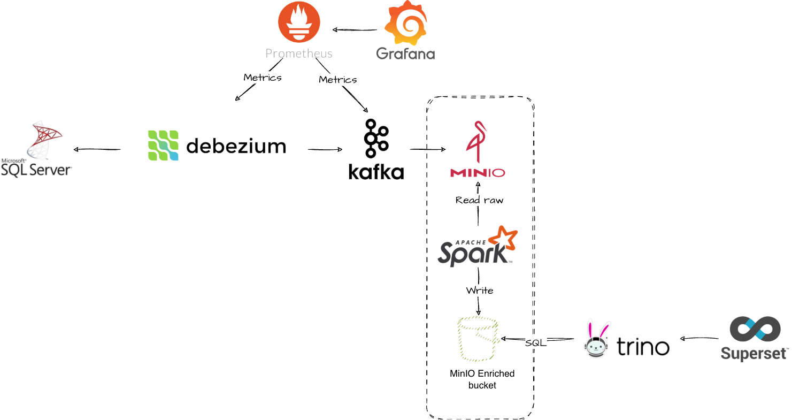

# Flight-Booking-CDC-Pipeline
[Intern] CDC Pipeline Project




## Directory Structure
```
flight-booking-cdc-pipeline/
│
├── docker-compose.yml          # Infrastructure setup file (Kafka, SQL Server, Kafka UI, MinIO, Spark, Iceberg REST,...)
├── .env.example                # System environment configurations example
├── requirements.txt            # Local Python dependencies (faker, pyodbc,...)
├── README.md                   # Setup and operations guide (Vietnamese version)
├── README_EN.md                # Setup and operations guide (English version)
├── download_jars.sh            # Bash script to download Spark driver JARs
│
├── db/                         # Database scripts folder
│   ├── schemas/
│   │   ├── init_schema.sql     # Database schema initialization
│   │   ├── drop_schema.sql     # Drop all tables in the database
│   │   └── reset_schema.sql    # Clean table data and reset auto-increment IDs to 0
│   └── cdc_setup/
│       └── enable_cdc.sql      # Enable CDC (Change Data Capture) on database and table levels
│
├── datagen_app/                # Python Data Generator & PNR Simulator Application
│   ├── generate_data.py        # Generate initial sample data (100,000 records)
│   ├── db_connection.py        # SQL Server connection helper
│   ├── main_simulator.py       # Main entry point for the PNR Transaction Simulator
│   └── scenarios/              # Business scenario simulations
│       ├── __init__.py
│       ├── book_new_flight.py  # Create a new flight booking (Book New Flight scenario)
│       ├── cancel_booking.py   # Cancel an existing flight booking (Cancel Booking scenario)
│       ├── change_flight.py    # Modify flight booking details (Change Flight scenario)
│       └── make_payment.py     # Process a transaction payment (Make Payment scenario)
│
├── connectors/                 # Kafka Connect configurations
│   ├── README.md               # Connector guide (Vietnamese version)
│   ├── README_EN.md            # Connector guide (English version)
│   ├── debezium-source.json    # JSON configuration for Debezium source (reads from SQL Server)
│   └── minio-sink.json         # JSON configuration for MinIO sink (dumps data from Kafka to MinIO Data Lake)
│
├── notebooks/                  # Jupyter Notebooks for environment setup
│   └── create_iceberg_tables.ipynb  # Notebook to initialize Iceberg tables
│
├── spark/                      # Apache Spark home directory
│   ├── README.md               # Spark execution guide (Vietnamese version)
│   ├── README_EN.md            # Spark execution guide (English version)
│   ├── jars/                   # Driver JAR files (MSSQL JDBC, AWS Bundle, Hadoop AWS)
│   └── scripts/                # PySpark ETL scripts (minio_loader, bronze_to_silver_transformer,...)
│
├── trino/                      # Trino configurations for querying data from Iceberg
│   └── etc/
│       └── catalog/
│           └── iceberg.properties # Iceberg connector properties for Trino
│
├── superset/                   # Apache Superset configurations for BI and data visualization
│   ├── Dockerfile              # Custom Dockerfile for Superset setup
│   └── superset_home/          # Home directory storing dashboard configs & database credentials
│
├── monitoring/                 # Monitoring configurations (Prometheus, Grafana)
│   ├── prometheus.yml          # Prometheus configuration file for scraping metrics
│   ├── debezium-dashboard.json # Grafana Dashboard template for Debezium
│   ├── kafka-dashboard.json    # Grafana Dashboard template for Kafka
│   └── grafana/                # Provisioning dashboard and data source configs for Grafana
│
└── conf/                       # System configuration files
    └── spark-defaults.conf     # Default configurations for Spark Iceberg
```

## Setup and Data Generation Guide

Follow the steps below to set up your environment, prepare the database, and run the simulator script to generate 100,000 flight booking records.


### 1. Prepare Python Environment (Local)
Create and activate a Python virtual environment, then install the required dependencies:

```bash
# Create a virtual environment named venv
python3 -m venv venv

# Activate the virtual environment (on macOS/Linux)
source venv/bin/activate

# Install required dependencies
pip install -r requirements.txt
```


### 2. Set Up Connection Configuration (.env)
Make sure you configure the `.env` file at the root of the project with the correct configuration. You can refer to `.env.example` as a template.


### 3. Run Infrastructure with Docker
Start all the infrastructure services using Docker Compose:
- **SQL Server (mssql)**: Stores the transactional database.
- **Apache Kafka (kafka)**: Message broker capturing the CDC logs.
- **Kafka UI (kafka-ui)**: Web UI to monitor Kafka topics and consumer groups.
- **Debezium (debezium)**: Kafka Connect source connector that tracks table changes in SQL Server.
- **MinIO (minio)**: S3-compatible Object Storage functioning as the Data Lake to store Parquet files.
- **Schema Registry (schema-registry)**: Stores and manages schemas in Avro format.
- **Iceberg REST Catalog (rest)**: REST Catalog managing metadata for Apache Iceberg.
- **Spark Iceberg (spark-iceberg)**: Run environment for PySpark jobs & Jupyter Notebook.

```bash
# Start all services in the background
docker-compose up -d
```


### 4. Set Up Database and CDC inside Docker (SQL Server)
Once SQL Server is running, execute the following commands to initialize the schema and enable CDC (Change Data Capture) directly inside the container:

1. **Initialize Database and Tables:**
   ```bash
   docker exec -i mssql /opt/mssql-tools18/bin/sqlcmd -S localhost -U sa -P 'yourPasswordHere' -C -d master < db/schemas/init_schema.sql
   ```
   *(Alternatively, you can run `init_schema.sql` directly inside your IDE.)*

2. **Enable CDC (Change Data Capture):**
   ```bash
   docker exec -i mssql /opt/mssql-tools18/bin/sqlcmd -S localhost -U sa -P 'yourPasswordHere' -C -d master < db/cdc_setup/enable_cdc.sql
   ```
   *(Alternatively, you can run `enable_cdc.sql` directly inside your IDE.)*

*Note: If you only want to clear the data inside all tables without dropping the tables or disabling CDC, you can run `reset_schema.sql`:*
```bash
docker exec -i mssql /opt/mssql-tools18/bin/sqlcmd -S localhost -U sa -P 'yourPasswordHere' -C -d master < db/schemas/reset_schema.sql
```


### 5. Run Data Generator Script (Initial Data Load)
Run the Python script from your local machine (with the `venv` activated) to automatically generate 100,000 transactional booking records and insert them into the SQL Server database:

```bash
python3 datagen_app/generate_data.py
```
* **How it works:** The script generates random PNR records, passenger details (1-3 passengers per transaction), flight segments (one-way or round-trip), and updates their payment status to completed (80% success rate) or leaves them as pending (20%).


### 6. Run PNR Transaction Simulator (Continuous Operation)
The PNR Simulator mimics real-world operations by continuously performing activities over time (e.g., booking new flights, paying for tickets, modifying flights, and canceling bookings). The simulator has two execution modes:

#### Mode 1: Continuous Random Mode (Default)
In this mode, scenarios are picked randomly based on predefined weights (Book New Flight: 50%, Make Payment: 30%, Change Flight: 10%, Cancel Booking: 10%) and executed continuously with a random sleep duration of 1 to 3 seconds between actions.
```bash
python3 datagen_app/main_simulator.py
```
*Press `Ctrl+C` to stop the simulator.*

#### Mode 2: Specific Scenario and Execution Count
Run a specific scenario for a predefined number of iterations.
```bash
python3 datagen_app/main_simulator.py <scenario_name> <number_of_runs>
```

Supported scenario names (`<scenario_name>`):
- `book_new_flight`: Simulates booking a new flight (creates PNR in `Created` state, passengers, and segments).
- `make_payment`: Finds an unpaid PNR and processes payment (updates status to `Ticketed` or `Cancelled`).
- `change_flight`: Finds a `Ticketed` PNR and changes its flight segment details.
- `cancel_booking`: Finds a valid PNR and cancels the booking (updates status to `Cancelled`).

**Examples:**
* Simulate booking a new flight 5 times:
  ```bash
  python3 datagen_app/main_simulator.py book_new_flight 5
  ```
* Simulate making a payment 3 times:
  ```bash
  python3 datagen_app/main_simulator.py make_payment 3
  ```

---

## System Operation Guide

Detailed steps to register connectors, initialize the Data Lake, and run the Spark ETL transformations.

### 1. Register the Debezium Source Connector
Register the Debezium Source Connector to start capturing changes (CDC) from SQL Server and publish them to Kafka. Check [connectors/README_EN.md] for details.
```bash
curl -i -X POST -H "Accept:application/json" -H "Content-Type:application/json" localhost:8083/connectors/ -d @connectors/debezium-source.json
```

### 2. Create Bucket on MinIO
- Access the MinIO Web Console at: http://localhost:9001.
- Navigate to **Buckets** -> click **Create Bucket** -> name it `datalake`.

### 3. Register the MinIO Sink Connector
After creating the `datalake` bucket on MinIO, register the MinIO Sink Connector to ingest CDC logs from Kafka to the Data Lake:
```bash
curl -i -X POST -H "Accept:application/json" -H "Content-Type:application/json" localhost:8083/connectors/ -d @connectors/minio-sink.json
```

### 4. Initialize Iceberg Tables
- Open Jupyter Notebook at: http://localhost:8888.
- Locate the notebook at [notebooks/create_iceberg_tables.ipynb] and run all cells to initialize the target Iceberg databases and table structures.

### 5. Download Drivers JAR & Wait for Data Sync
- Wait for Kafka Connect to sync the CDC logs into the `datalake` bucket as Parquet files.
- Download the required Spark driver JARs (if you haven't already):
  ```bash
  chmod +x download_jars.sh
  ./download_jars.sh
  ```

### 6. Run Spark ETL Jobs
Use `spark-submit` to execute the ETL scripts inside the Spark container (see [spark/README_EN.md] for more information):
- **Load Raw Data from MinIO to Bronze Tables:**
  ```bash
  docker compose exec spark-iceberg /opt/spark/bin/spark-submit \
    --jars /home/iceberg/pyspark/jars/hadoop-aws-3.3.4.jar,/home/iceberg/pyspark/jars/aws-java-sdk-bundle-1.12.262.jar \
    /home/iceberg/pyspark/scripts/minio_loader.py
  ```
- **Clean and Merge Data from Bronze to Silver Tables (De-duplication and Upserts):**
  ```bash
  docker compose exec spark-iceberg /opt/spark/bin/spark-submit \
    /home/iceberg/pyspark/scripts/bronze_to_silver_transformer.py
  ```
- **Aggregate and Load Data from Silver to Gold Tables (Analytical Summaries):**
  ```bash
  docker compose exec spark-iceberg /opt/spark/bin/spark-submit \
    /home/iceberg/pyspark/scripts/silver_to_gold_transformer.py
  ```
- *(Optional) Reconcile and Validate Data Between SQL Server Source and Silver Tables:*
  ```bash
  docker compose exec spark-iceberg /opt/spark/bin/spark-submit \
    --jars /home/iceberg/pyspark/jars/mssql-jdbc-12.4.2.jre11.jar,/home/iceberg/pyspark/jars/hadoop-aws-3.3.4.jar,/home/iceberg/pyspark/jars/aws-java-sdk-bundle-1.12.262.jar \
    /home/iceberg/pyspark/scripts/data_reconciliation.py
  ```

### 7. BI Dashboard Setup (Superset) & System Monitoring (Prometheus/Grafana)

Once the Docker Compose services are fully running, you can access the BI and system monitoring tools via the following local URLs:

* **Apache Superset (BI Tool):**
  * URL: [http://localhost:8088](http://localhost:8088)
  * Default Credentials: `admin` / `admin`
  * **Connecting to Apache Iceberg via Trino:**
    1. In the Superset Web UI, navigate to **Settings** -> **Database Connections** -> **+ Database**.
    2. Select **Trino** as the database type.
    3. Input the Connection URI: `trino://admin@trino:8080/iceberg`
    4. Click **Connect** and save. You can now query and build dashboards from your Iceberg tables (Silver, Gold layers).

* **Prometheus (Metrics Collection):**
  * URL: [http://localhost:9090](http://localhost:9090)
  * Used to view scrape targets and raw metrics for Kafka, Debezium, etc.

* **Grafana (Monitoring Dashboards):**
  * URL: [http://localhost:3000](http://localhost:3000)
  * Default Credentials: `admin` / `admin`
  * Automatically provisioned with sample dashboards for monitoring Kafka and Debezium Connect metrics.

